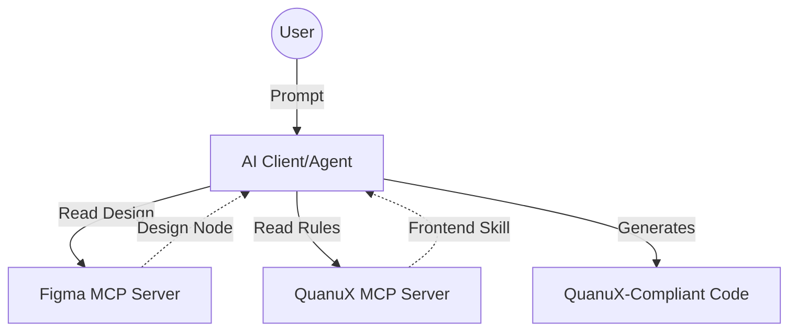

# Figma Integration Guide (Designer-to-Code Workflow)

This guide details how to integrate **Figma** with the **QuanuX Platform** to enable AI agents to generate production-ready, compliant React code directly from your designs.

## Overview

The workflow relies on **MCP Server Composition**. By connecting your AI Client to two servers simultaneously, you give the AI access to both the *Design* and the *Rules*:

1.  **Figma Desktop MCP Server** (Official): Provides the raw design data (layout, props, colors).
2.  **QuanuX Local MCP Server**: Provides the `react-frontend-standards` Agent Skill (architectural rules, Shadcn usage, Backend-Driven protocols).



## Prerequisites

1.  **Figma Desktop App**: Ensure you are running the latest version with **Dev Mode** availability (Beta).
2.  **MCPClient**: A desktop agent application (e.g., Claude Desktop, Cursor, or a custom scripted agent) that supports multiple MCP servers.
3.  **QuanuX Server**: Running locally (`python3 -m server.mcp.server`).

## Configuration

### 1. Enable Figma MCP
1.  Open Figma Desktop.
2.  Enter **Dev Mode** (Shift + D).
3.  Open the **Inspect** panel.
4.  Enable "MCP Server" (if available in your Beta/Plan).
    *   *Default URL*: `http://127.0.0.1:3845/mcp`

### 2. Configure Your Agent
Add both servers to your agent's configuration file (e.g., `claude_desktop_config.json`).

```json
{
  "mcpServers": {
    "figma": {
      "command": "npx",
      "args": ["-y", "@figma/mcp-server"] 
      // OR point to the local desktop URL if supported via a bridge
    },
    "quanux": {
      "command": "python3",
      "args": ["-m", "server.mcp.server"],
      "env": { "PYTHONPATH": "/absolute/path/to/QuanuX" }
    }
  }
}
```

## The Workflow

### Step 1: Design in Figma
Create your UI in Figma using standard best practices (Auto Layout, named layers).

### Step 2: Select & Prompt
1.  **Select** the frame or component in Figma (e.g., `OrderEntryForm`).
2.  **Prompt** your connected Agent:

> "Inspect the selected Figma node. Generate a React component for this design.
> **IMPORTANT**: Use the `react-frontend-standards` skill to ensure the code follows QuanuX architecture (Backend-Driven UI, Shadcn, Tailwind)."

### Step 3: Verification
The Agent will:
1.  Call `figma.get_selection()` to parse the layout.
2.  Call `agent.skills.read('react-frontend-standards')` to load our coding rules.
3.  Output a `.tsx` file that:
    *   Uses **Tailwind** for styling (matching Figma tokens).
    *   Uses **Shadcn** components where appropriate.
    *   **Does NOT** contain mock logic (per Backend-Driven rule).

## Troubleshooting
*   **"Skill not found"**: Ensure QuanuX server is running and `client/skills/react-frontend-standards/SKILL.md` exists.
*   **Figma Connection Refused**: Ensure Figma Desktop is open and Dev Mode is active.
