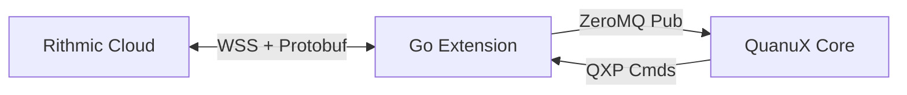

# Rithmic Integration (QXP Native)

**State**: ✅ Production-Ready (Go Native)
**Protocol**: Google Protocol Buffers (Official v0.87.0.0 schema)
**Transport**: WebSocket (SSL) with Big Endian Length-Prefix Framing
**Auth Flow**: 2-Step Handshake (Discovery -> Login)

The QuanuX Rithmic Extension is a high-performance, native Go implementation that bypasses the need for the legacy C++ R/API+ libraries or Python bridges. It speaks the raw wire wire protocol directly to Rithmic's servers.

## 1. Architecture

The extension runs as a standard QXP sidecar process.



### Key Components
-   **Official Protobufs**: We ingest the official `.proto` files (v0.87.0.0+) directly.
-   **Go Runtime**: Pure Go implementation for minimal latency and mostly garbage-free streaming.
-   **ZeroMQ Data Pump**: Market data ticks are broadcast via ZMQ PUB socket (default port 5557).

## 2. The Rithmic Wire Protocol

Rithmic uses a specific flavor of Protocol Buffers over WebSocket.

### A. Framing
Every message sent or received is prefixed with a **4-byte Big Endian Integer** indicating the payload length.
`[LENGTH (4 bytes)] + [PROTOBUF PAYLOAD (N bytes)]`

### B. Template IDs
Rithmic uses a `template_id` field in every message to determine the message type. This is **CRITICAL**.
The extension uses the `api` package generated from official protos, but you must manually map message types based on the `TemplateId` field.

| Message Name | Template ID | Description |
| :--- | :--- | :--- |
| `RequestLogin` | 10 | Primary authentication request. |
| `ResponseLogin` | 11 | Auth result. Check `rp_code`. |
| `RequestRithmicSystemInfo` | 16 | Step 1 of handshake. |
| `ResponseRithmicSystemInfo` | 17 | Returns available systems. |
| `RequestHeartbeat` | 18 | Sent every 30s. |
| `ResponseHeartbeat` | 19 | Server Ack. |
| `RequestMarketDataUpdate` | 100 | Sub/Unsub request. |
| `LastTrade` | 150 | Live tick data. |

## 3. Authentication Flow (The "Handshake")

Rithmic requires a specific sequence:

1.  **Connect 1 (Discovery)**:
    -   Open WebSocket.
    -   Send `RequestRithmicSystemInfo` (Template 16).
    -   Receive `ResponseRithmicSystemInfo` containing valid System Names (e.g., "Rithmic Test").
    -   **Close Connection**.

2.  **Connect 2 (Login)**:
    -   Open **New** WebSocket.
    -   Send `RequestLogin` (Template 10) with `system_name` obtained from Step 1.
    -   Receive `ResponseLogin` (Template 11).
    -   If `rp_code == "0"`, you are authenticated.

3.  **Heartbeat Loop**:
    -   You MUST send `RequestHeartbeat` (Template 18) every ~30 seconds (or as specified in `heartbeat_interval` from login).
    -   If you fail to do this, the server will disconnect you.

## 4. Development & Extension

### Directory Structure
-   `extensions/rithmic/`
    -   `proto/`: Official `.proto` files. **Source of Truth**.
    -   `api/`: Generated Go bindings. **Do not edit manually**.
    -   `main.go`: The Extension logic.

### Regenerating Protos
If you update the `.proto` files (e.g., new Rithmic version), you must regenerate the Go code:
```bash
# In extensions/rithmic/
go mod tidy
protoc -I=proto --go_out=api --go_opt=paths=source_relative --go-grpc_out=api --go-grpc_opt=paths=source_relative proto/*.proto
```
*Note: We use a patch script to inject the `go_package` option if missing.*

## 5. Security

Credentials are injected via Environment Variables by `quanuxctl`:

-   `QUANUX_RITHMIC_USER`
-   `QUANUX_RITHMIC_PASS`
-   `QUANUX_RITHMIC_SYSTEM` (e.g., "Rithmic Paper Trading")
-   `QUANUX_RITHMIC_URL` (wss://rituz00100.rithmic.com:443)

**NEVER commit creds to git.**
