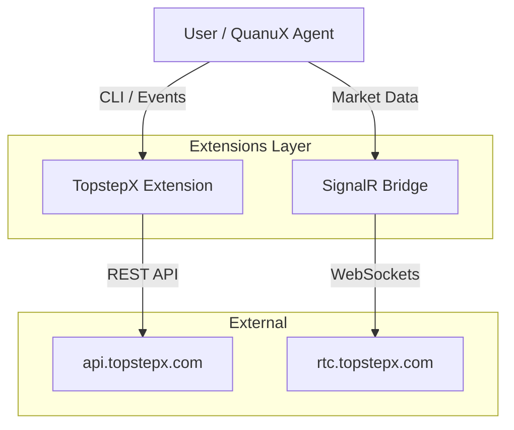

# TopstepX Integration Guide

## Overview
The **TopstepX Integration** enables QuanuX to interact with the TopstepX platform for trading, account management, and real-time market data. It is architected as a set of decoupled [QuanuX Extensions](EXTENSIONS.md):

1.  **TopstepX Interface (`quanux-topstepx`)**: A Python-based REST client for account retrieval, order execution, and history.
2.  **SignalR Bridge (`quanux-bridge-signalr`)**: A polyglot (Node.js/Python) bridge that maintains a persistent WebSocket connection to TopstepX's SignalR hubs for real-time market data and user events.

## Architecture



## Configuration

### Credentials
All sensitive credentials are stored securely in the system keyring via `quanuxctl`. They are **never** stored in plain text configuration files.

| Key | Description |
| :--- | :--- |
| `QUANUX_TOPSTEP__USERNAME` | TopstepX Username |
| `QUANUX_TOPSTEP__PASSWORD` | TopstepX Password |
| `QUANUX_TOPSTEP__API_KEY` | TopstepX API Key |

### Endpoints (Defaults)
The extensions are pre-configured for the production environment but can be overridden via `quanuxctl`.

| Key | Default Value | Description |
| :--- | :--- | :--- |
| `QUANUX_TOPSTEP__BASE_API_URL` | `https://api.topstepx.com` | REST API Base URL |
| `QUANUX_SIGNALR_USER_HUB` | `https://rtc.topstepx.com/hubs/user` | Real-time User Events |
| `QUANUX_SIGNALR_MARKET_HUB` | `https://rtc.topstepx.com/hubs/market` | Real-time Market Data |

## Usage

### CLI Management (`quanuxctl`)
Manage the integration directly from the command line:

```bash
# Set Credentials
quanuxctl topstepx user "myuser"
quanuxctl topstepx password "mypass"
quanuxctl topstepx apikey "mykey"

# Verify Environment
quanuxctl topstepx env

# Install Dependencies
quanuxctl topstepx install
```

### SignalR Bridge
The bridge runs as a separate process managed by QuanuX. It connects to the configured hubs and broadcasts events to the local QuanuX message bus.

**Status Check:**
```bash
quanuxctl bridge status
```

**Manual Start (Debug):**
```bash
quanuxctl bridge run
```

## Developer Usage

### Python Extension (`extensions/python/topstepx`)
The extension exposes a standard interface for interactions. The source code is located in `extensions/python/topstepx/src`.

**Key Modules:**
*   `auth.py`: Handles authentication and token management.
*   `orders.py`: Order placement and management.
*   `positions.py`: Position tracking.
*   `history.py`: Historical bar retrieval.

### SignalR Bridge (`extensions/python/signalr_bridge`)
The bridge uses a Node.js worker (default) or Flask app to handle the proprietary SignalR protocol.

**Custom Hub Configuration:**
If you need to connect to a different environment (e.g., simulation):
```bash
quanuxctl topstepx user-hub "https://sim-rtc.topstepx.com/hubs/user"
quanuxctl topstepx market-hub "https://sim-rtc.topstepx.com/hubs/market"
```
