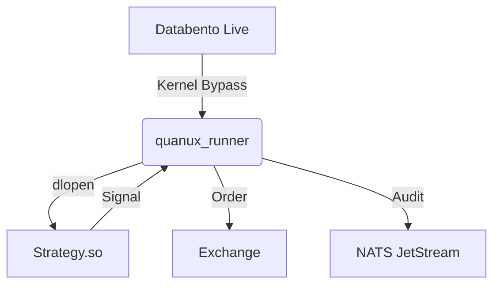

# QuanuX Architecture: The Universal Runner (Phase 3)

## The "Eureka" Discovery
We have built the **Brain** (Indicators) and the **Nervous System** (Runtime), but we lack the **Cardiovascular System** (Data Pump). 

Currently, strategies are passive shared libraries (`.so`). They need a host to "pump" life (ticks) into them.

## The Solution: `quanux_runner`
One optimized C++ binary to rule them all.

### 1. Architecture
*   **Role**: A "Strategy Container" optimized for <10µs latency.
*   **Mechanism**:
    1.  **Loader**: `dlopen`s the strategy shared object.
    2.  **Feed**: Connects to the data source (Databento Live, NATS Replay, or PCAP).
    3.  **Hot Loop**: Pumps data directly into the strategy's `on_tick()` method.



### 2. The Universal Interface
Every strategy (C++ or Python Proxy) implements this specialized ABI:

```cpp
// strategy_interface.h
class Strategy {
public:
    virtual void on_tick(const Tick& tick) = 0;
    virtual void on_order_update(const Order& order) = 0;
};

// Exported Factory
extern "C" Strategy* create_strategy();
```

### 3. "Zero-Code" Backtesting
Because the *Runner* abstracts the feed, the **Same Strategy Binary** can be backtested without recompilation.
*   **Live**: `./quanux_runner --strat=demo.so --feed=databento --live`
*   **Replay**: `./quanux_runner --strat=demo.so --feed=pcap --file=2023_data.pcap`

### 4. Implementation Plan
1.  **Feed Handler**: Integrate `databento` C++ client.
2.  **Plugin Loader**: Implement `dlopen` wrapper in `execution-node/cpp`.
3.  **The Runner**: Create the `main()` loop that bridges Feed -> Plugin.
