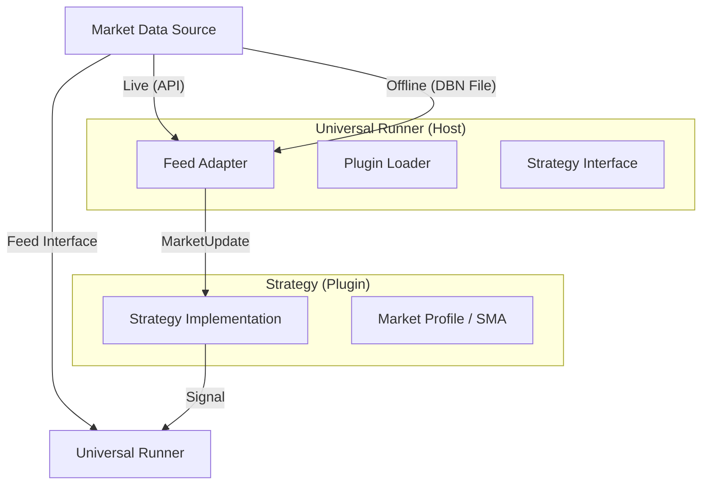

# Universal Runner: Technical Architecture

**Component**: `execution-node/cpp` (Binary: `quanux_runner`)
**Role**: The "Host" process for HFT strategies.
**Status**: Production Ready (Phase 3 Complete)

## Overview

The Universal Runner is a high-performance C++20 container designed to execute trading strategies with zero-copy data access. It decouples the **Execution Engine** (checking limits, routing orders) from the **Strategy Logic** (alpha generation).

Strategies are compiled as **Dynamic Libraries** (`.dylib` on macOS, `.so` on Linux) and loaded at runtime. This allows hot-swapping (in theory) and strict isolation of concerns.

## Architecture



## Data Plane: The Feed Interface

The runner supports two modes of operation, transparent to the strategy:

1.  **Live Mode**: Connects directly to Databento's Live API (via `libdatabento`).
    *   Command: `--key <KEY> --dataset GLBX.MDP3`
    *   Latency: Microsecond-scale (Zero-copy from network buffer).
2.  **Offline Mode**: Replays generic DBN (Databento Binary Encoding) files.
    *   Command: `--file <PATH.dbn>`
    *   Capability: Supports MBO (L3), MBP-10 (L2), and Trades.
    *   **L3 Support**: Automatically converts `MboMsg` (Action 'T') to Trade Updates.

## Strategy ABI

Strategies must implement the C-ABI defined in `strategy_interface.h`. This ensures binary compatibility.

### Required Symbols

Every strategy shared object must export the following `extern "C"` entry point:

```cpp
Strategy* create_strategy();
```

This returns a `Strategy` struct containing function pointers:

```cpp
struct Strategy {
    const char* name;
    StrategyContext* (*create_context)();
    void (*destroy_context)(StrategyContext*);
    void (*on_init)(StrategyContext*, const OrderService*);
    void (*on_market_data)(StrategyContext*, const MarketUpdate*);
    // ... other callbacks
};
```

### Writing a Strategy

See `execution-node/cpp/strategies/demo_strategy.cpp` for a reference implementation.

**Key Requirements:**
*   **No Global State**: Use `create_context` to allocate instance data.
*   **No Exceptions**: ABI boundaries must not leak C++ exceptions. Catch them internally.
*   **Zero Copy**: `MarketUpdate*` is read-only and ephemeral. Do not store the pointer; copy data if needed.

## Building & Running

### Build
```bash
# Debug Build (Recommended for Backtesting)
cmake -S execution-node/cpp -B execution-node/cpp/build
cmake --build execution-node/cpp/build --target quanux_runner demo_strategy
```

### Run (Offline)
```bash
./execution-node/cpp/build/quanux_runner \
    --strategy execution-node/cpp/build/demo_strategy.dylib \
    --file data/raw/glbx-mdp3-20260122.mbo.dbn
```

### Run (Live - Rithmic)
```bash
./execution-node/cpp/build/quanux_runner \
    --strategy execution-node/cpp/build/demo_strategy.dylib \
    --feed rithmic \
    --ruser <USER> --rpass <PASS> \
    --symbol ESH6
```

### Run (Live - Databento)
```bash
export DATABENTO_API_KEY=db-xc...
./execution-node/cpp/build/quanux_runner \
    --strategy execution-node/cpp/build/demo_strategy.dylib \
    --symbol ESH6
```
